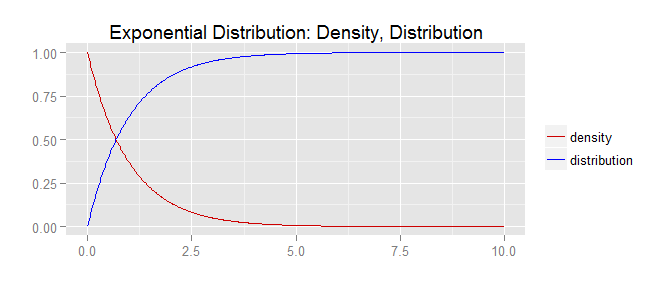
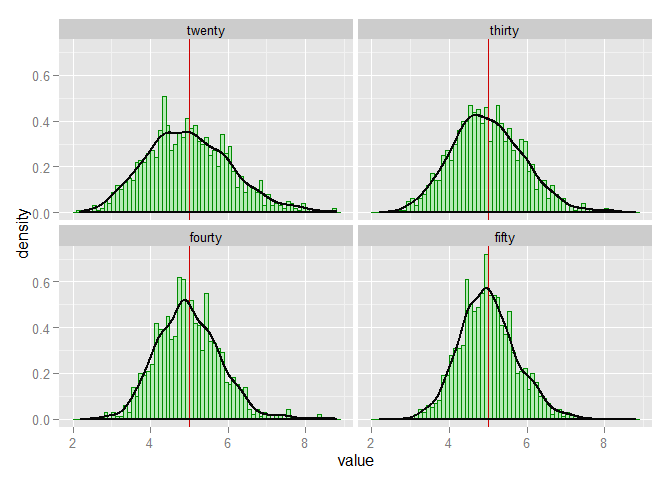
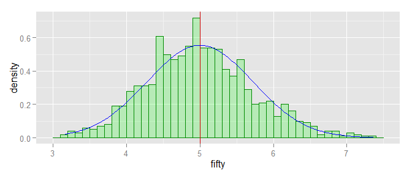

# Statistical Inference: Exponential Distribution
Eddie Warner  

## Overview: 


Explore the exponential distribution as this distribution conforms to the law of large numbers and the how this distribution compares to the Central Limit Theorem. 

Definition of the exponential distribution and relevant characteristics. 

"In probability theory and statistics, the exponential distribution (a.k.a. negative exponential distribution) is the probability distribution that describes the time between events in a Poisson process, i.e. a process in which events occur continuously and independently at a constant average rate... " [@wiki_ed]

## Simulations: 

Standard distributions implemented in R allow for the generation of as much data as needed to explore fundamental principals of statistics. In R the exponential distribution are implemented in the following functions dexp (density), pexp (distribution), qexp (quantile) and rexp (random). For simulations for this exploration of the exponential distribution and random variables generated (variance, mean) rexp will be used. 

### definitions

For all simulations $\lambda$ will be set to 0.2. 
By definition the theoretical mean $\mu$ is $1 / \lambda$.  
The variance var would be $1 / \lambda^2$ 


```r
lambda <- 0.2; seed <- 789
µ <- 1 / 0.2; var <- 1 / (0.2 ^ 2)
num <- 1000; samples <- c(20, 30, 40, 50)
```

First plot the exponential distribution for $\lambda 0.2$ using dexp and pexp. 

 

## Sample Mean versus Theoretical Mean: 

Plot sample mean vs theorectical mean (population mean) as the sample mean increases. As the sample size increases according to the Central Limit Theorem the sample mean will more closely approximate the population mean. Sample sizes will be 20, 30, 40 and 50. 


```r
set.seed(seed); sample_means <- data.frame( twenty = replicate(num, mean(rexp(samples[1], lambda))))
sample_means <- sample_means %>% 
    mutate(thirty = replicate(num, mean(rexp(samples[2], lambda)))) %>%     
    mutate(fourty = replicate(num, mean(rexp(samples[3], lambda)))) %>% 
    mutate(fifty = replicate(num, mean(rexp(samples[4], lambda))))
col_means <- sample_means %>% summarise_each(funs(mean))
```

**Sample size and mean**  

The table below shows a trend towards the population mean with a bit of jitter for sample size 20 and 30.
See plots below for which show not only that the sample mean approaches the population mean, but that the ramdom variable representing the sample mean become more consentrated around the population mean. Also notice that values in the right hand tail become more normal. Because the exponential distribution goes from $0 to \infty$ there will be more values in the right tail for small sample sizes.

|Sample Size | Mean |
|------------|------|
|20|4.9934861|
|30|4.9905553|
|40|4.9794017|
|50|4.9963051|


```r
melt_sample_means <- reshape2::melt(data = sample_means, id.vars = c())
means_plot <- ggplot(melt_sample_means,aes(x = value)) 
means_plot <-  means_plot +  facet_wrap(~variable, scales = "fixed")  
means_plot <-  means_plot +  geom_histogram(col="green4", fill="green",  alpha = .2, binwidth=.1, 
                                            aes(y = ..density..))
means_plot <-  means_plot + geom_vline(xintercept = 5, col="red3")
means_plot <-  means_plot + geom_density(col="grey2", size = 1)
means_plot
```

 


## Sample Variance versus Theoretical Variance: 

The sample variance of the mean sould approach the theoretical mean of the sample given by $s^2/n$  


```r
predicted_means = NULL
# calculate predicted varance for our sample sizes
for (i in 1 : length(samples)) {    predicted_means <- c(predicted_means, ((1/lambda)^2)/ samples[i])}
# calculate actual variance for our sample means
col_var <- sample_means %>% summarise_each(funs(var))
names(predicted_means) <- names(col_var)
```


-------  ----------
twenty    1.2500000
thirty    0.8333333
fourty    0.6250000
fifty     0.5000000
-------  ----------

  
  


   twenty      thirty      fourty       fifty
---------  ----------  ----------  ----------
 1.179679   0.8466509   0.6348968   0.5169846

  

In a separate calculation the mean of the actual variance for the Exponential Distribution will approach the variance of the population. 


```r
set.seed(seed); sample_var <- data.frame( twenty = replicate(num, var(rexp(samples[1], lambda))))
sample_var <- sample_var %>% 
    mutate(thirty = replicate(num, var(rexp(samples[2], lambda)))) %>%     
    mutate(fourty = replicate(num, var(rexp(samples[3], lambda)))) %>% 
    mutate(fifty = replicate(num, var(rexp(samples[4], lambda))))
col_var_mean <- sample_var %>% summarise_each(funs(mean))
```

As noted in the facts secion above the variance for $\lambda = .2$ is 25.  


   twenty     thirty     fourty      fifty
---------  ---------  ---------  ---------
 24.84444   25.00839   25.11325   24.91518


## Distribution: 

A distribution is aproximently normal if that distribution is symetric around the mean and fits within a normal distribution. See figure below.

"In probability theory, the central limit theorem (CLT) states that, given certain conditions, the arithmetic mean of a sufficiently large number of iterates of independent random variables, each with a well-defined expected value and well-defined variance, will be approximately normally distributed, regardless of the underlying distribution."

 


## References:
