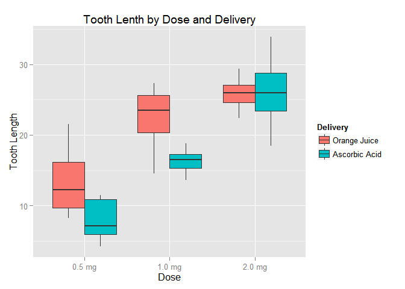

# Statistical Inference: Exponential Distribution
Eddie Warner  

## Overview:

Explore the ToothGrowth {datasets} using exploratory data analysis, confidence levels and hypothesis testing. This data set The *Effect of Vitamin C on Tooth Growth in Guinea Pigs* represents the following study.  

"The response is the length of odontoblasts (teeth) in each of 10 guinea pigs at each of three dose levels of Vitamin C (0.5, 1, and 2 mg) with each of two delivery methods (orange juice or ascorbic acid)."


## Data 
Load and examine data. Data consists of three columns, interestingly in comparison to ChickWeight there are no identifying column for individual Guinea Pigs. So the assumption must be that each measure was taken with a different subject (pig). 


```r
data(ToothGrowth)
summary(ToothGrowth)
```

```
##       len        supp         dose      
##  Min.   : 4.20   OJ:30   Min.   :0.500  
##  1st Qu.:13.07   VC:30   1st Qu.:0.500  
##  Median :19.25           Median :1.000  
##  Mean   :18.81           Mean   :1.167  
##  3rd Qu.:25.27           3rd Qu.:2.000  
##  Max.   :33.90           Max.   :2.000
```

```r
str(ToothGrowth)
```

```
## 'data.frame':	60 obs. of  3 variables:
##  $ len : num  4.2 11.5 7.3 5.8 6.4 10 11.2 11.2 5.2 7 ...
##  $ supp: Factor w/ 2 levels "OJ","VC": 2 2 2 2 2 2 2 2 2 2 ...
##  $ dose: num  0.5 0.5 0.5 0.5 0.5 0.5 0.5 0.5 0.5 0.5 ...
```

Create a factor based on dose easier grouping and plotting.


```r
ToothGrowth$dose <- factor(ToothGrowth$dose, levels = c(0.5,1.0,2.0), labels=c("0.5 mg", "1.0 mg", "2.0 mg"),)
```

## Plots
Plot each dose and delivery method against tooth length. Remove outlaying observations


```r
dose_supp <- ggplot(aes(y = len, x = dose, fill = supp), data = ToothGrowth) + geom_boxplot(outlier.shape=NA)
dose_supp <- dose_supp + labs(x = "Dose", y = "Tooth Length", title = "Tooth Lenth by Dose and Delivery")
dose_supp <- dose_supp + scale_fill_discrete(
                       name="Delivery",
                       labels=c("Orange Juice", "Ascorbic Acid"))
dose_supp
```

 
Empirically from examining the plot dose of vitamin c would be the strongest factor for tooth length. For lower doses of vitamin c orange Juice is more effective than assobic acid.

## Analysis

From exploration, the delivry method of Orange Juice was better at low doses. Now confirm this result by performing t-tests testing the different delivery methods for the different dose levels. 

As noted above the analysis assumes that each dose ~ delivery where carried out on a different subject (pig). As such we test with the assumption that subjects are not paired and that subject have an unequal varience.

We will assume for our **H0** hypothesis that the delivery method are equal in effectivness. We will use the 95% confidence interval.

### Create a wide data set

```r
wide <- ToothGrowth %>% filter(supp == "OJ", dose == "0.5 mg") %>% 
    mutate(OJ_0.5mg = len) %>% select(OJ_0.5mg)
wide <- cbind(wide, ToothGrowth %>% filter(supp == "VC", dose == "0.5 mg") 
              %>% mutate(VC_0.5mg = len) %>% select(VC_0.5mg))
wide <- cbind(wide, ToothGrowth %>% filter(supp == "OJ", dose == "1.0 mg") 
              %>% mutate(OJ_1.0mg = len) %>% select(OJ_1.0mg))
wide <- cbind(wide, ToothGrowth %>% filter(supp == "VC", dose == "1.0 mg") 
              %>% mutate(VC_1.0mg = len) %>% select(VC_1.0mg))
wide <- cbind(wide, ToothGrowth %>% filter(supp == "OJ", dose == "2.0 mg") 
              %>% mutate(OJ_2.0mg = len) %>% select(OJ_2.0mg))
wide <- cbind(wide, ToothGrowth %>% filter(supp == "VC", dose == "2.0 mg") 
              %>% mutate(VC_2.0mg = len) %>% select(VC_2.0mg))
```
### Test Dose = 0.5 mg


```r
dose.0.5 <- t.test(wide['OJ_0.5mg'] - wide['VC_0.5mg'], paired = FALSE, var.equal = FALSE)
dose.0.5$conf.int
```

```
## [1] 1.263458 9.236542
## attr(,"conf.level")
## [1] 0.95
```

```r
dose.0.5$p.value
```

```
## [1] 0.01547205
```


